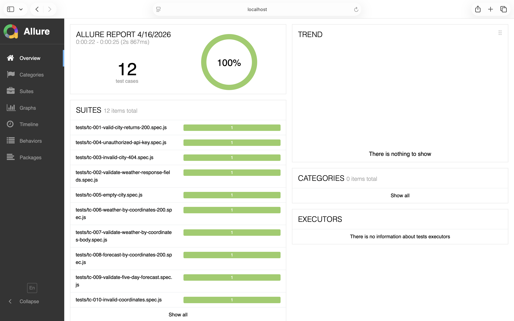

# Weather API Automation Framework (Playwright)

##  Overview

This project is an API automation framework built using **Playwright** to test the **OpenWeatherMap API**.

It follows clean architecture principles with a reusable service layer, supports parallel execution, and uses environment-based configuration.

---

##  Tech Stack

* Playwright (API Testing)
* Node.js
* JavaScript
* dotenv (for environment variables)

---

## 📁 Project Structure

```
weather-api-playwright/
├── tests/             # Test cases
├── services/          # API service layer (POM)
├── utils/             # Config and utilities
├── playwright.config.js
├── package.json
├── .env.example
└── README.md
```

---

## ⚙️ Setup Instructions

### 1. Clone the repository

```
git clone https://github.com/22F3000107/weather-api-playwright.git
cd weather-api-playwright
```

### 2. Install dependencies

```
npm install
```

### 3. Configure environment variables

Create a `.env` file and add:

```
API_KEY=your_api_key_here
BASE_URL=https://api.openweathermap.org/data/2.5
```

---

## ▶️ Run Tests

```
npx playwright test
```

---

## 📊 Test Scenarios Covered

*  Validate weather data for valid city (Status 200)
*  Validate response fields (temperature, humidity, description)
*  Invalid city handling (Status 404)
*  Unauthorized access (invalid API key – Status 401)
*  Edge cases:

  * Empty city
  * Special characters

---

## ⚡ Features

* Reusable API service layer (POM design)
* Parallel test execution using Playwright workers
* Environment-based configuration using dotenv
* Clean and scalable project structure

---

## 📈 Reporting

To generate HTML report:

```
npx playwright test --reporter=html
```

---

## 📊 Allure Report




##  Notes

* `.env` file is not committed for security reasons
* Use `.env.example` as reference

---

## 👨‍💻 Author

Deepak Kumar
